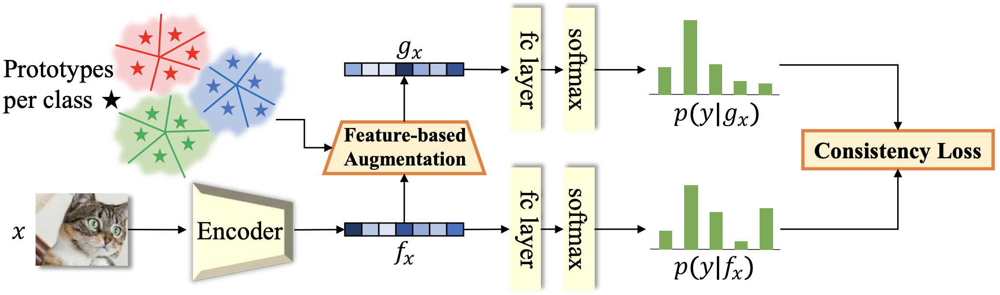
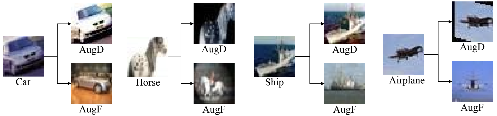

## FeatMatch: Feature-Based Augmentation for Semi-Supervised Learning

This is the PyTorch implementation of our paper:\
**FeatMatch: Feature-Based Augmentation for Semi-Supervised Learning**\
**_[Chia-Wen Kuo]_**, [Chih-Yao Ma], [Jia-Bin Huang], [Zsolt Kira]\
European Conference on Computer Vision (ECCV), 2020\
[[arXiv]] [[Project]]

## Abstract

Recent state-of-the-art semi-supervised learning (SSL) methods use a combination of image-based transformations and consistency regularization as core components. Such methods, however, are limited to simple transformations such as traditional data augmentation or convex combinations of two images. In this paper, we propose a novel learned feature-based refinement and augmentation method that produces a varied set of complex transformations. Importantly, these transformations also use information from both within-class and across-class prototypical representations that we extract through clustering. We use features already computed across iterations by storing them in a memory bank, obviating the need for significant extra computation. These transformations, combined with traditional image-based augmentation, are then used as part of the consistency-based regularization loss. We demonstrate that our method is comparable to current state of art for smaller datasets (CIFAR-10 and SVHN) while being able to scale up to larger datasets such as CIFAR-100 and mini-Imagenet where we achieve significant gains over the state of art (e.g., absolute 17.44% gain on mini-ImageNet). We further test our method on DomainNet, demonstrating better robustness to out-of-domain unlabeled data, and perform rigorous ablations and analysis to validate the method.

## Installation

### Prequesites

* python == 3.7
* pytorch == 1.6
* torchvision == 0.7

Install python dependencies:

    pip install -r requirements.txt

To augment data faster, we recommend using [Pillow-SIMD](https://github.com/uploadcare/pillow-simd).

*Note: this project was developed under torch\==1.4 originally. During code release, it is ported to torch\==1.6 for the native support of automatic mixed precision (amp) training. The numbers are slightly different from those on the paper but are within the std margins.*

### Datasets

Download/Extract the following datasets to the [dataset](dataset) folder under the project root directory.

* For SVHN, download train and test sets [here][svhn].
* For CIFAR-10 and CIFAR-100, download the python version dataset [here][cifar].
* For mini-ImageNet, use the following command to extract mini-ImageNet from ILSVRC-12:

      python3 dataloader/mini_imagenet.py -sz 128 \
       -sd [ILSVRC-12_ROOT] \
       -dd dataset/mini-imagenet
  Replace `[ILSVRC-12_ROOT]` with the root folder of your local ILSVRC-12 dataset.

* For DomainNet, use the following command to download the domains:

      python3 dataloader/domainnet.py -r dataset/domainnet

## Training

All commands should be run under the project root directory.

### Running arguments

    -cf CONFIG: training config
    -d GPU_IDS: GPUs where the model is trained on
    -n SAVE_ROOT: root directory where the checkpoints are saved to
    -i ITERS: number of runs for average performance

### CIFAR-100

    # 4k labels
    python3 train/featmatch.py -cf config/cifar100/[cifar100][test][cnn13][4000].json -d 0 1 -n [cifar100][test][cnn13][4000] -i 3 -o -a
    
    # 10k labels
    python3 train/featmatch.py -cf config/cifar100/[cifar100][test][cnn13][10000].json -d 0 1 -n [cifar100][test][cnn13][10000] -i 3 -o -a

### mini-ImageNet

    # 4k labels
    python3 train/featmatch.py -cf config/mini-imagenet/[mimagenet][test][res18][4000].json -d 0 1 -n [mimagenet][test][res18][4000] -i 3 -o -a

    # 10k lables
    python3 train/featmatch.py -cf config/mini-imagenet/[mimagenet][test][res18][10000].json -d 0 1 -n [mimagenet][test][res18][10000] -i 3 -o -a

### DomainNet

    # ru = 0%
    python3 train/featmatch.py -cf config/domainnet/[domainnet][test][res18][rl5-ru00].json -d 0 1 -n [domainnet][test][res18][rl5-ru00] -i 3 -a

    # ru = 25%
    python3 train/featmatch.py -cf config/domainnet/[domainnet][test][res18][rl5-ru25].json -d 0 1 -n [domainnet][test][res18][rl5-ru25] -i 3 -a

    # ru = 50%
    python3 train/featmatch.py -cf config/domainnet/[domainnet][test][res18][rl5-ru50].json -d 0 1 -n [domainnet][test][res18][rl5-ru50] -i 3 -a

    # ru = 75%
    python3 train/featmatch.py -cf config/domainnet/[domainnet][test][res18][rl5-ru75].json -d 0 1 -n [domainnet][test][res18][rl5-ru75] -i 3 -a

### SVHN

    # 250 labels
    python3 train/featmatch.py -cf config/svhn/[svhn][test][wrn][250].json -d 0 1 -n [svhn][test][wrn][250] -i 3 -o -a

    # 1k labels
    python3 train/featmatch.py -cf config/svhn/[svhn][test][wrn][1000].json -d 0 1 -n [svhn][test][wrn][1000] -i 3 -o -a

    # 4k labels
    python3 train/featmatch.py -cf config/svhn/[svhn][test][wrn][4000].json -d 0 1 -n [svhn][test][wrn][4000] -i 3 -o -a

### CIFAR-10

    # 250 labels
    python3 train/featmatch.py -cf config/cifar10/[cifar10][test][wrn][250].json -d 0 1 -n [cifar10][test][wrn][250] -i 3 -o -a

    # 1k labels
    python3 train/featmatch.py -cf config/cifar10/[cifar10][test][wrn][1000].json -d 0 1 -n [cifar10][test][wrn][1000] -i 3 -o -a

    # 4k labels
    python3 train/featmatch.py -cf config/cifar10/[cifar10][test][wrn][4000].json -d 0 1 -n [cifar10][test][wrn][4000] -i 3 -o -a

## Results

Here are the quantitative results on different datasets, with different number of labels. Numbers represent error rate in three runs (lower the better).

For CIFAR-100, mini-ImageNet, CIFAR-10, and SVHN, we follow the conventional evaluation method.
The model is evaluated directly on the test set, and the median of the last _K_ (_K_=10 in our case) testing accuracies is reported.

For our proposed DomainNet setting, we reserve 1% of validation data, which is much fewer than the 5% of labeled data.
The model is evaluated on the validation data, and the model with the best validation accuracy is selected.
Finally, we report the test accuracy of the selected model.

### CIFAR-100
\#labels | 4k | 10k
--- | --- | --- 
paper | 31.06 ± 0.41 |  26.83 ± 0.04 
repo | 30.79 ± 0.35 | 26.88 ± 0.13

### mini-ImageNet
\#labels | 4k | 10k
--- | --- | --- 
paper | 39.05 ± 0.06 | 34.79 ± 0.22 
repo | 38.94 ± 0.19 | 34.84 ± 0.19

### DomainNet
_ru_ | 0% | 25% | 50% | 75%
--- | --- | --- | --- | ---
paper | 40.66 ± 0.60 | 46.11 ± 1.15 | 54.01 ± 0.66 | 58.30 ± 0.93 
repo | 40.47 ± 0.23 | 43.40 ± 0.25 | 52.49 ± 1.06 | 56.20 ± 1.25

### SVHN
\#labels | 250 | 1k | 4k
--- | --- | --- | ---
paper | 3.34 ± 0.19 | 3.10 ± 0.06 | 2.62 ± 0.08
repo | 3.62 ± 0.12 | 3.02 ± 0.04 | 2.61 ± 0.02

### CIFAR-10
\#labels | 250 | 1k | 4k
--- | --- | --- | ---
paper | 7.50 ± 0.64 | 5.76 ± 0.07 |  4.91 ± 0.18
repo | 7.38 ± 0.94 | 6.04 ± 0.24 | 5.19 ± 0.05

## Acknowledgement
This work was funded by DARPA’s Learning with Less Labels (LwLL) program under agreement HR0011-18-S-0044 and DARPAs Lifelong Learning Machines (L2M) program under Cooperative Agreement HR0011-18-2-0019.

## Citation
    @inproceedings{kuo2020featmatch,
      title={Featmatch: Feature-based augmentation for semi-supervised learning},
      author={Kuo, Chia-Wen and Ma, Chih-Yao and Huang, Jia-Bin and Kira, Zsolt},
      booktitle={European Conference on Computer Vision},
      pages={479--495},
      year={2020},
      organization={Springer}
    }

[svhn]: http://ufldl.stanford.edu/housenumbers/
[cifar]: https://www.cs.toronto.edu/~kriz/cifar.html
[mini_imagenet]: https://github.com/twitter/meta-learning-lstm/tree/master/data/miniImagenet
[zca]: https://drive.google.com/drive/folders/14DDmdqMvBSp45ivk589-jpVq9Q4as0xA?usp=sharing

[Chia-Wen Kuo]: https://sites.google.com/view/chiawen-kuo/home
[Chih-Yao Ma]: https://chihyaoma.github.io/
[Jia-Bin Huang]: https://filebox.ece.vt.edu/~jbhuang/
[Zsolt Kira]: https://www.cc.gatech.edu/~zk15/
[arXiv]: https://arxiv.org/abs/2007.08505
[Project]: https://sites.google.com/view/chiawen-kuo/home/featmatch